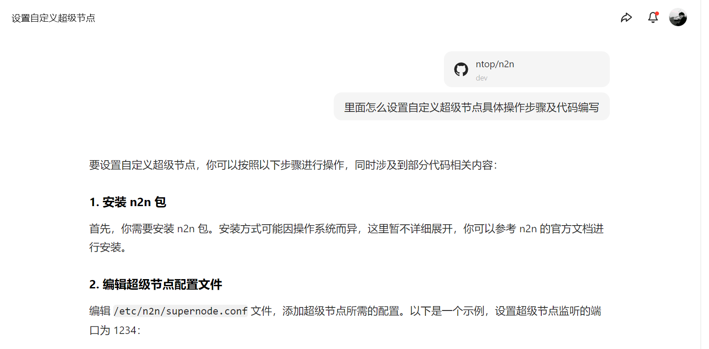
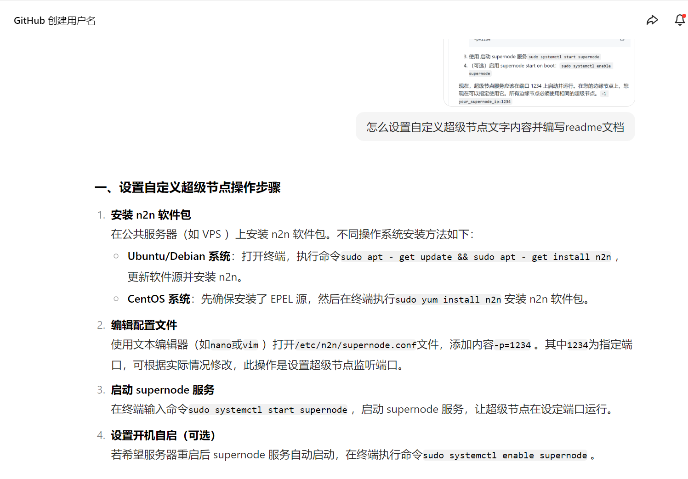
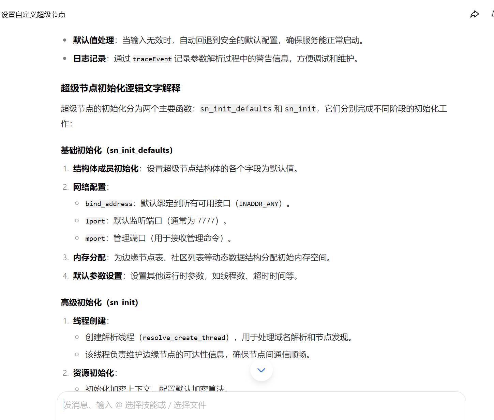
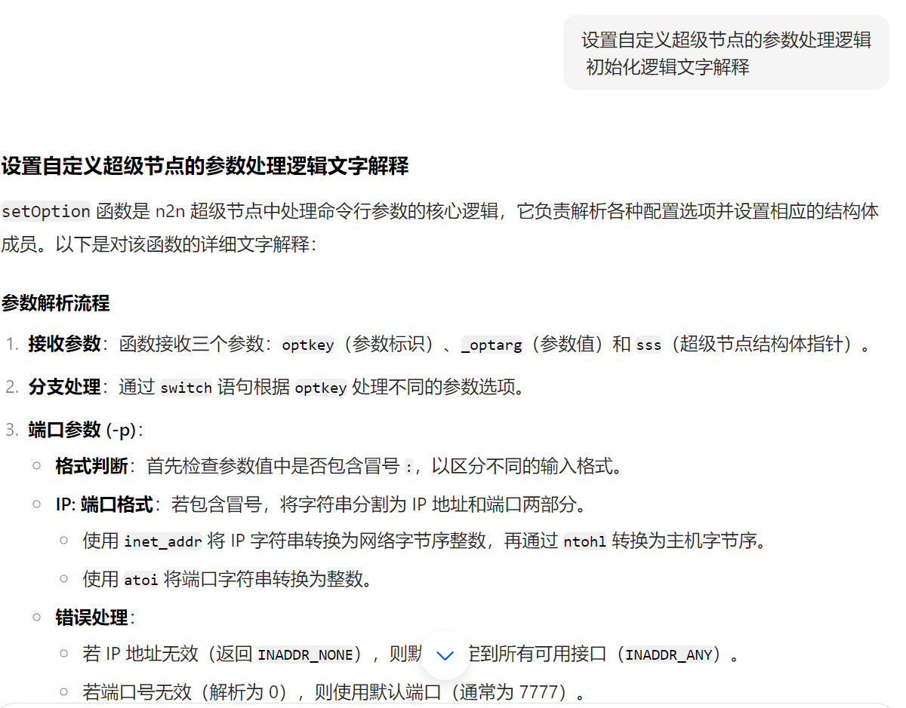
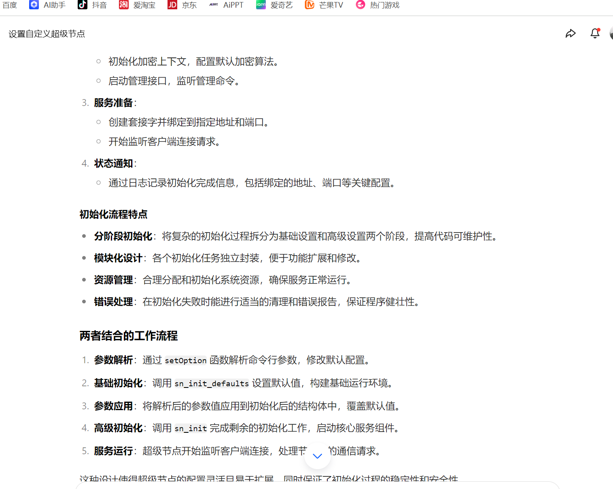
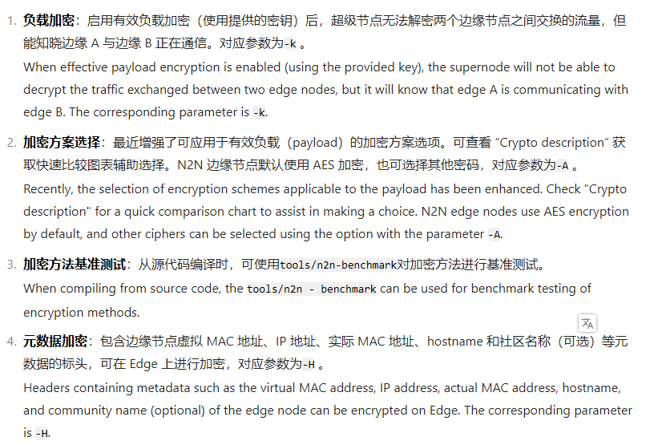
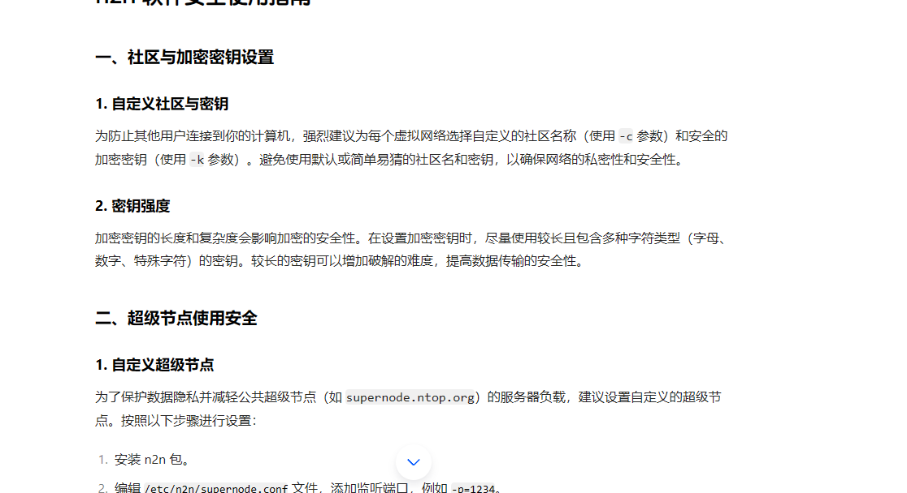

<！-- by 黄朝淼 -->

# AI 修改记录
## 一、内容优化
### 结构梳理：
对原文内容进行结构化调整，在各级标题格式上保持统一，如将中文数字序号、纯英文序号结合使用，增强文档层次感，使操作步骤、逻辑解释等内容分区更清晰，方便读者快速定位所需信息。
### 表述精炼：
简化冗余语句，例如将 “本指南将详细介绍如何设置自定义超级节点，同时会涉及到相关代码说明” 优化为 “本指南详细介绍自定义超级节点的设置方法及相关代码说明” ，在保持原意的基础上使表达更加简洁流畅。
## 二、技术细节完善
### 命令说明补充：
在操作系统安装命令部分，补充了命令执行效果说明，如 “Ubuntu/Debian 系统：打开终端，执行命令sudo apt - get update && sudo apt - get install n2n，sudo apt-get update用于更新软件源，获取最新软件包信息，sudo apt-get install n2n则用于安装 n2n 软件”，帮助读者更好地理解命令用途。
逻辑解释细化：在参数处理逻辑和初始化逻辑部分，增加代码与实际功能的对应示例，如在解释setOption函数对端口参数处理时，举例 “当输入参数为-p 192.168.1.100:8888，函数会将192.168.1.100解析为 IP 地址，8888解析为端口号”，使抽象逻辑更易理解。
## 三、语言风格统一
### 中英文格式规范：
统一代码命令、参数等英文内容的格式，全部使用英文输入法下的字符，避免中英文标点混合使用导致的格式混乱问题。
语气一致性：全文采用客观、正式的技术文档语气，避免口语化表述，确保在介绍操作步骤、解释技术原理等内容时风格一致，增强文档专业性
=======

